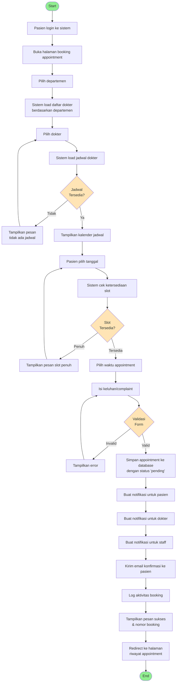
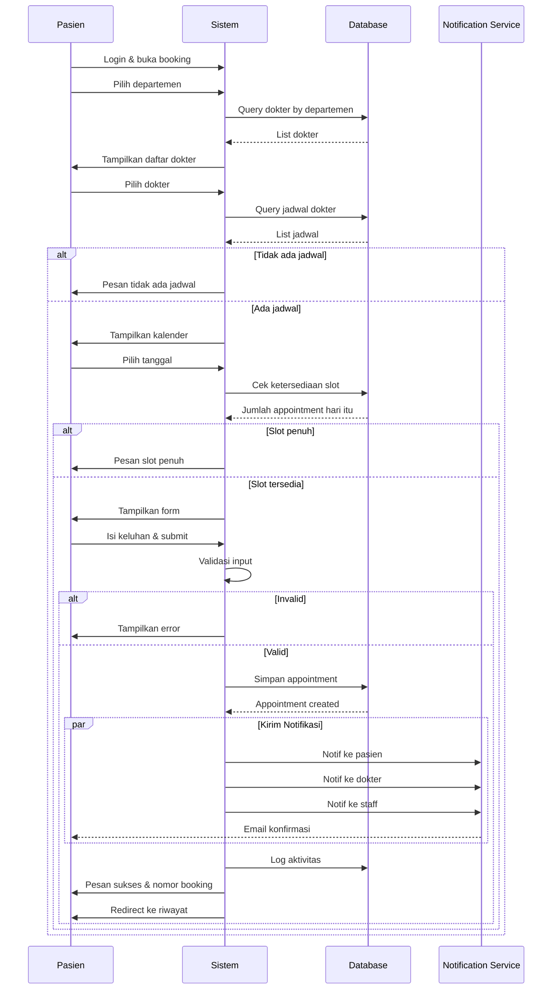

# Activity Diagram - Booking Appointment

## Swimlane Diagram

## Deskripsi Proses

### 1. Persiapan Booking
- Pasien harus login terlebih dahulu
- Akses halaman booking appointment
- Sistem menampilkan form multi-step

### 2. Pemilihan Departemen
- Pasien memilih departemen (IGD, Poli Umum, Poli Gigi, dll)
- Sistem query database untuk mendapatkan dokter yang terkait dengan departemen tersebut
- Tampilkan daftar dokter dengan foto, nama, spesialisasi

### 3. Pemilihan Dokter
- Pasien memilih dokter yang diinginkan
- Sistem query jadwal praktek dokter dari tabel doctor_schedules
- Filter jadwal yang aktif (is_active = true)

### 4. Cek Ketersediaan Jadwal
- Jika dokter tidak memiliki jadwal aktif:
  - Tampilkan pesan "Dokter belum memiliki jadwal praktek"
  - Kembali ke pemilihan dokter
- Jika ada jadwal:
  - Tampilkan kalender dengan hari-hari praktek dokter
  - Highlight tanggal yang tersedia

### 5. Pemilihan Tanggal dan Waktu
- Pasien memilih tanggal dari kalender
- Sistem cek jumlah appointment yang sudah ada pada tanggal tersebut
- Bandingkan dengan max_quota dari doctor_schedules
- Jika slot penuh (appointment >= max_quota):
  - Tampilkan pesan "Slot penuh, pilih tanggal lain"
  - Kembali ke pemilihan tanggal
- Jika slot tersedia:
  - Tampilkan waktu praktek (start_time - end_time)
  - Lanjut ke form keluhan

### 6. Pengisian Form
- Pasien mengisi keluhan/complaint (textarea)
- Validasi:
  - Complaint tidak boleh kosong
  - Minimal 10 karakter
  - Maksimal 500 karakter

### 7. Penyimpanan Data
- Simpan ke tabel appointments dengan data:
  - patient_id (dari user yang login)
  - doctor_id (dokter yang dipilih)
  - schedule_date (tanggal yang dipilih)
  - start_time (dari jadwal dokter)
  - complaint (keluhan pasien)
  - status = 'pending'
- Generate nomor booking unik

### 8. Notifikasi
- Buat notifikasi untuk pasien: "Appointment Anda berhasil dibuat"
- Buat notifikasi untuk dokter: "Appointment baru dari [nama pasien]"
- Buat notifikasi untuk staff: "Appointment baru perlu konfirmasi"
- Kirim email konfirmasi ke pasien dengan detail appointment

### 9. Logging dan Redirect
- Log aktivitas ke audit_logs
- Tampilkan pesan sukses dengan nomor booking
- Redirect ke halaman riwayat appointment

### Decision Points
- **Jadwal Tersedia**: Cek apakah dokter memiliki jadwal aktif
- **Slot Tersedia**: Cek apakah quota belum penuh
- **Validasi Form**: Cek kelengkapan dan format input

### Business Rules
- Pasien hanya bisa booking untuk tanggal hari ini atau ke depan
- Satu pasien maksimal 3 appointment pending
- Tidak bisa booking di hari yang sama dengan appointment lain yang sudah confirmed
- Appointment otomatis cancelled jika tidak dikonfirmasi dalam 24 jam
