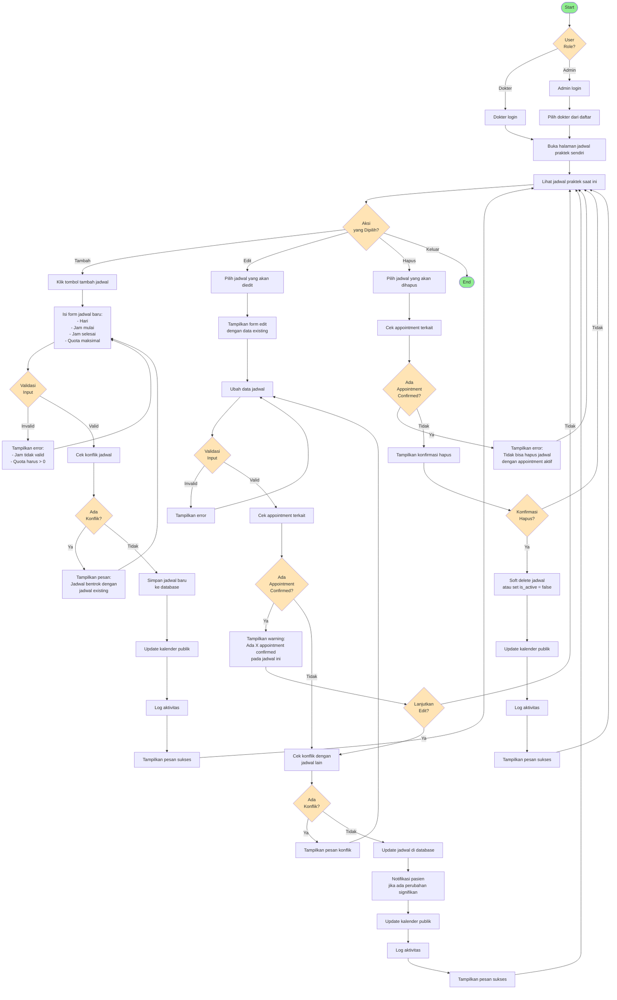
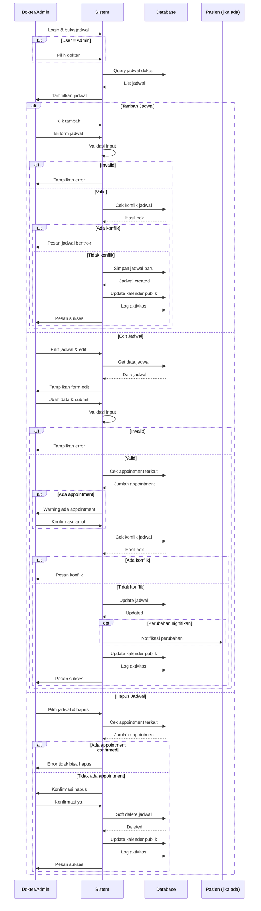

# Activity Diagram - Kelola Jadwal Dokter

## Swimlane Diagram

## Deskripsi Proses

### 1. Akses Halaman Jadwal

#### Dokter:
- Login dengan role 'dokter'
- Langsung akses jadwal praktek sendiri
- Hanya bisa mengelola jadwal milik sendiri

#### Admin:
- Login dengan role 'admin'
- Akses halaman manajemen jadwal dokter
- Pilih dokter dari dropdown/list
- Bisa mengelola jadwal semua dokter

### 2. Tampilan Jadwal Saat Ini
- Sistem query tabel doctor_schedules berdasarkan doctor_id
- Tampilkan dalam format tabel atau kalender:
  - Hari praktek
  - Jam mulai - Jam selesai
  - Quota maksimal
  - Status (Aktif/Nonaktif)
  - Jumlah appointment yang sudah terjadwal
  - Aksi (Edit, Hapus, Toggle Status)

### 3. Tambah Jadwal Baru

#### Form Input:
- **Hari**: Dropdown (Senin - Minggu)
- **Jam Mulai**: Time picker (format 24 jam)
- **Jam Selesai**: Time picker (format 24 jam)
- **Quota Maksimal**: Number input (default 20)
- **Status**: Checkbox aktif (default checked)

#### Validasi:
- Jam selesai harus lebih besar dari jam mulai
- Minimal durasi praktek 1 jam
- Maksimal durasi praktek 12 jam
- Quota harus antara 1-100
- Semua field required

#### Cek Konflik:
- Query jadwal existing untuk dokter yang sama
- Cek apakah ada jadwal di hari yang sama dengan rentang waktu yang overlap
- Contoh konflik:
  - Existing: Senin 08:00-12:00
  - New: Senin 10:00-14:00 → KONFLIK
  - New: Senin 13:00-17:00 → OK

#### Jika Valid:
- Simpan ke tabel doctor_schedules
- Update cache kalender publik
- Log aktivitas: "Menambah jadwal praktek [hari] [jam]"

### 4. Edit Jadwal Existing

#### Proses:
- Klik tombol edit pada jadwal
- Form terisi dengan data existing
- User ubah data yang diperlukan
- Submit form

#### Validasi Tambahan:
- Cek apakah ada appointment confirmed pada jadwal ini
- Query: `SELECT COUNT(*) FROM appointments WHERE doctor_id = ? AND day_of_week = ? AND status = 'confirmed'`
- Jika ada appointment:
  - Tampilkan warning: "Ada X appointment confirmed pada jadwal ini"
  - Berikan opsi:
    - Lanjutkan edit (appointment tetap valid)
    - Batal edit

#### Perubahan Signifikan:
Jika ada perubahan pada jam praktek > 1 jam:
- Kirim notifikasi ke semua pasien dengan appointment confirmed
- Notifikasi: "Jadwal praktek Dr. [nama] berubah dari [jam lama] menjadi [jam baru]"
- Berikan opsi reschedule jika pasien tidak bisa

#### Jika Valid:
- Update record di doctor_schedules
- Update kalender publik
- Kirim notifikasi jika perlu
- Log aktivitas: "Mengubah jadwal praktek [hari] dari [jam lama] ke [jam baru]"

### 5. Hapus Jadwal

#### Validasi:
- Cek appointment confirmed pada jadwal ini
- Jika ada appointment confirmed:
  - Tampilkan error: "Tidak dapat menghapus jadwal dengan appointment aktif"
  - Sarankan untuk nonaktifkan jadwal saja
  - Tidak bisa lanjut hapus

#### Jika Tidak Ada Appointment:
- Tampilkan modal konfirmasi:
  - "Yakin ingin menghapus jadwal [hari] [jam]?"
  - Tombol: Batal | Hapus
- Jika konfirmasi Ya:
  - Soft delete (set deleted_at) atau
  - Set is_active = false
  - Update kalender publik
  - Log aktivitas: "Menghapus jadwal praktek [hari] [jam]"

### 6. Toggle Status Aktif/Nonaktif
- Fitur tambahan untuk menonaktifkan sementara tanpa hapus
- Jadwal nonaktif tidak muncul di kalender publik
- Tidak bisa booking appointment pada jadwal nonaktif
- Appointment existing tetap valid

### Decision Points
- **User Role**: Tentukan akses (dokter hanya jadwal sendiri, admin semua)
- **Validasi Input**: Cek kelengkapan dan format data
- **Ada Konflik**: Cek overlap dengan jadwal existing
- **Ada Appointment Confirmed**: Validasi sebelum edit/hapus
- **Lanjutkan Edit**: Konfirmasi jika ada appointment
- **Konfirmasi Hapus**: Konfirmasi sebelum delete

### Business Rules
- Dokter hanya bisa kelola jadwal sendiri
- Admin bisa kelola jadwal semua dokter
- Tidak boleh ada jadwal overlap untuk dokter yang sama
- Tidak bisa hapus jadwal dengan appointment confirmed
- Perubahan signifikan harus notifikasi pasien
- Semua perubahan jadwal harus tercatat di audit log
- Jadwal nonaktif tidak muncul di kalender publik
- Minimal durasi praktek 1 jam, maksimal 12 jam
- Quota minimal 1, maksimal 100 pasien per sesi
