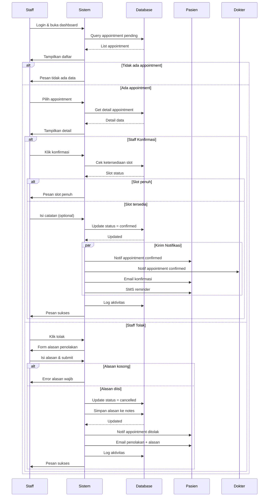

# Activity Diagram - Konfirmasi Appointment

```mermaid
flowchart TD
    Start([Start]) --> A1[Staff login ke sistem]
    
    A1 --> A2[Buka dashboard staff]
    
    A2 --> A3[Lihat daftar appointment pending]
    
    A3 --> A4{Ada<br/>Appointment<br/>Pending?}
    
    A4 -->|Tidak| A5[Tampilkan pesan<br/>tidak ada appointment]
    A5 --> End1([End])
    
    A4 -->|Ya| A6[Pilih appointment untuk direview]
    
    A6 --> A7[Lihat detail appointment:<br/>- Data pasien<br/>- Dokter<br/>- Jadwal<br/>- Keluhan]
    
    A7 --> A8{Keputusan<br/>Staff}
    
    A8 -->|Konfirmasi| B1[Cek ulang ketersediaan slot]
    
    B1 --> B2{Slot<br/>Masih<br/>Tersedia?}
    
    B2 -->|Tidak| B3[Tampilkan pesan slot penuh]
    B3 --> A8
    
    B2 -->|Ya| B4[Update status appointment<br/>menjadi 'confirmed']
    
    B4 --> B5[Isi catatan konfirmasi<br/>jika diperlukan]
    
    B5 --> B6[Simpan perubahan ke database]
    
    B6 --> B7[Buat notifikasi untuk pasien:<br/>"Appointment dikonfirmasi"]
    
    B7 --> B8[Buat notifikasi untuk dokter:<br/>"Appointment dikonfirmasi"]
    
    B8 --> B9[Kirim email konfirmasi ke pasien]
    
    B9 --> B10[Kirim SMS reminder ke pasien]
    
    B10 --> B11[Log aktivitas konfirmasi]
    
    B11 --> B12[Tampilkan pesan sukses]
    
    B12 --> A3
    
    A8 -->|Tolak| C1[Isi alasan penolakan]
    
    C1 --> C2{Alasan<br/>Diisi?}
    
    C2 -->|Tidak| C3[Tampilkan error:<br/>alasan wajib diisi]
    C3 --> C1
    
    C2 -->|Ya| C4[Update status appointment<br/>menjadi 'cancelled']
    
    C4 --> C5[Simpan alasan ke notes]
    
    C5 --> C6[Buat notifikasi untuk pasien:<br/>"Appointment ditolak"]
    
    C6 --> C7[Kirim email penolakan<br/>dengan alasan]
    
    C7 --> C8[Log aktivitas penolakan]
    
    C8 --> C9[Tampilkan pesan sukses]
    
    C9 --> A3
    
    style Start fill:#90EE90
    style End1 fill:#FFB6C1
    style A4 fill:#FFE4B5
    style A8 fill:#FFE4B5
    style B2 fill:#FFE4B5
    style C2 fill:#FFE4B5
```

## Swimlane Diagram



## Deskripsi Proses

### 1. Akses Dashboard Staff
- Staff login dengan kredensial
- Sistem redirect ke dashboard staff
- Dashboard menampilkan widget:
  - Jumlah appointment pending hari ini
  - Jumlah appointment confirmed hari ini
  - Antrian pasien
  - Pesan kontak belum dibaca

### 2. Lihat Daftar Appointment Pending
- Sistem query tabel appointments dengan filter:
  - status = 'pending'
  - Diurutkan berdasarkan created_at (FIFO)
- Tampilkan dalam tabel dengan kolom:
  - Nomor booking
  - Nama pasien
  - Dokter
  - Tanggal & waktu
  - Keluhan (preview)
  - Aksi (Lihat Detail, Konfirmasi, Tolak)

### 3. Review Detail Appointment
- Staff klik "Lihat Detail"
- Sistem tampilkan informasi lengkap:
  - **Data Pasien**: Nama, NIK, Umur, Gender, Kontak
  - **Data Dokter**: Nama, Spesialisasi, Foto
  - **Jadwal**: Tanggal, Hari, Waktu praktek
  - **Keluhan**: Complaint lengkap dari pasien
  - **Riwayat**: Appointment sebelumnya (jika ada)

### 4. Keputusan Staff

#### A. Konfirmasi Appointment
- Staff klik tombol "Konfirmasi"
- Sistem cek ulang ketersediaan:
  - Query jumlah appointment confirmed pada tanggal & dokter yang sama
  - Bandingkan dengan max_quota
- Jika slot masih tersedia:
  - Update status appointment = 'confirmed'
  - Staff bisa menambahkan catatan (optional)
  - Simpan ke database
- Jika slot penuh:
  - Tampilkan pesan error
  - Sarankan untuk menghubungi pasien dan reschedule

#### B. Tolak Appointment
- Staff klik tombol "Tolak"
- Sistem tampilkan form alasan penolakan
- Validasi alasan:
  - Tidak boleh kosong
  - Minimal 20 karakter
  - Maksimal 500 karakter
- Jika valid:
  - Update status appointment = 'cancelled'
  - Simpan alasan ke kolom notes
  - Simpan ke database

### 5. Notifikasi

#### Jika Dikonfirmasi:
- **Notifikasi Pasien**:
  - Title: "Appointment Dikonfirmasi"
  - Message: "Appointment Anda dengan Dr. [nama] pada [tanggal] telah dikonfirmasi"
- **Notifikasi Dokter**:
  - Title: "Appointment Baru Dikonfirmasi"
  - Message: "Appointment dengan pasien [nama] pada [tanggal] telah dikonfirmasi"
- **Email ke Pasien**:
  - Subject: "Konfirmasi Appointment - [Nama RS]"
  - Body: Detail lengkap appointment + reminder
- **SMS Reminder**:
  - "Appointment Anda dengan Dr. [nama] pada [tanggal] jam [waktu] telah dikonfirmasi. Harap datang 15 menit sebelumnya."

#### Jika Ditolak:
- **Notifikasi Pasien**:
  - Title: "Appointment Ditolak"
  - Message: "Maaf, appointment Anda ditolak. Alasan: [alasan]"
- **Email ke Pasien**:
  - Subject: "Pemberitahuan Penolakan Appointment"
  - Body: Alasan penolakan + saran untuk booking ulang

### 6. Logging
- Log ke audit_logs dengan data:
  - user_id: Staff yang melakukan aksi
  - action: 'confirm_appointment' atau 'reject_appointment'
  - model_type: 'Appointment'
  - model_id: ID appointment
  - old_values: Status lama (pending)
  - new_values: Status baru (confirmed/cancelled)
  - ip_address: IP staff

### 7. Feedback
- Tampilkan toast notification sukses
- Refresh daftar appointment pending
- Update counter widget di dashboard

### Decision Points
- **Ada Appointment Pending**: Cek apakah ada data untuk direview
- **Slot Masih Tersedia**: Validasi ulang quota sebelum konfirmasi
- **Alasan Diisi**: Validasi alasan penolakan
- **Keputusan Staff**: Konfirmasi atau tolak

### Business Rules
- Staff hanya bisa konfirmasi appointment untuk hari ini atau ke depan
- Appointment yang sudah melewati tanggal otomatis cancelled
- Staff harus memberikan alasan jika menolak appointment
- Setiap konfirmasi/penolakan harus tercatat di audit log
- Pasien yang appointmentnya ditolak bisa booking ulang tanpa batasan
