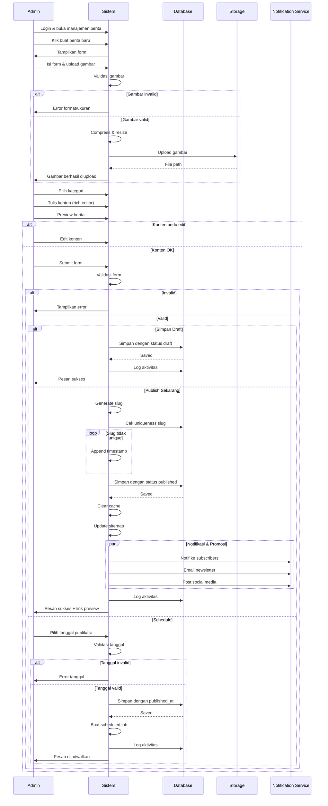

# Activity Diagram - Publikasi Berita

```mermaid
flowchart TD
    Start([Start]) --> A1[Admin login ke sistem]
    
    A1 --> A2[Buka halaman manajemen berita]
    
    A2 --> A3[Klik tombol buat berita baru]
    
    A3 --> A4[Isi form berita:<br/>- Judul<br/>- Kategori<br/>- Excerpt<br/>- Konten body]
    
    A4 --> A5[Upload gambar thumbnail]
    
    A5 --> A6{Gambar<br/>Valid?}
    
    A6 -->|Tidak| A7[Tampilkan error:<br/>- Format tidak didukung<br/>- Ukuran terlalu besar]
    A7 --> A5
    
    A6 -->|Ya| A8[Compress & resize gambar]
    
    A8 --> A9[Upload ke storage]
    
    A9 --> A10[Simpan path gambar]
    
    A10 --> A11[Pilih kategori berita]
    
    A11 --> A12[Tulis konten dengan<br/>rich text editor]
    
    A12 --> A13[Preview berita]
    
    A13 --> A14{Konten<br/>Sudah OK?}
    
    A14 -->|Belum| A15[Edit konten]
    A15 --> A12
    
    A14 -->|Sudah| A16{Validasi<br/>Form}
    
    A16 -->|Invalid| A17[Tampilkan error:<br/>- Judul wajib diisi<br/>- Konten minimal 100 karakter<br/>- Kategori wajib dipilih]
    A17 --> A4
    
    A16 -->|Valid| A18{Pilihan<br/>Admin}
    
    A18 -->|Simpan Draft| B1[Set status = 'draft']
    
    B1 --> B2[Set published_at = null]
    
    B2 --> B3[Generate slug dari judul]
    
    B3 --> B4[Simpan ke database]
    
    B4 --> B5[Log aktivitas:<br/>'Membuat draft berita']
    
    B5 --> B6[Tampilkan pesan:<br/>'Draft berhasil disimpan']
    
    B6 --> A2
    
    A18 -->|Publish Sekarang| C1[Set status = 'published']
    
    C1 --> C2[Set published_at = now()]
    
    C2 --> C3[Generate slug dari judul]
    
    C3 --> C4{Slug<br/>Unique?}
    
    C4 -->|Tidak| C5[Append timestamp ke slug]
    C5 --> C4
    
    C4 -->|Ya| C6[Simpan ke database]
    
    C6 --> C7[Clear cache berita]
    
    C7 --> C8[Update sitemap]
    
    C8 --> C9[Buat notifikasi untuk subscribers]
    
    C9 --> C10[Kirim email newsletter<br/>jika ada subscribers]
    
    C10 --> C11[Post ke social media<br/>jika terintegrasi]
    
    C11 --> C12[Log aktivitas:<br/>'Mempublikasi berita']
    
    C12 --> C13[Tampilkan pesan sukses<br/>dengan link preview]
    
    C13 --> A2
    
    A18 -->|Schedule| D1[Pilih tanggal & waktu publikasi]
    
    D1 --> D2{Tanggal<br/>Valid?}
    
    D2 -->|Tidak| D3[Tampilkan error:<br/>Tanggal harus di masa depan]
    D3 --> D1
    
    D2 -->|Ya| D4[Set status = 'draft']
    
    D4 --> D5[Set published_at = tanggal pilihan]
    
    D5 --> D6[Generate slug]
    
    D6 --> D7[Simpan ke database]
    
    D7 --> D8[Buat scheduled job<br/>untuk auto-publish]
    
    D8 --> D9[Log aktivitas:<br/>'Menjadwalkan berita']
    
    D9 --> D10[Tampilkan pesan:<br/>'Berita dijadwalkan untuk [tanggal]']
    
    D10 --> A2
    
    A2 --> A19{Aksi<br/>Lain?}
    
    A19 -->|Edit Berita| E1[Pilih berita dari list]
    E1 --> E2[Load data berita]
    E2 --> A4
    
    A19 -->|Hapus Berita| F1[Pilih berita]
    F1 --> F2[Konfirmasi hapus]
    F2 --> F3{Konfirmasi?}
    F3 -->|Ya| F4[Soft delete berita]
    F4 --> F5[Log aktivitas]
    F5 --> A2
    F3 -->|Tidak| A2
    
    A19 -->|Keluar| End([End])
    
    style Start fill:#90EE90
    style End fill:#90EE90
    style A6 fill:#FFE4B5
    style A14 fill:#FFE4B5
    style A16 fill:#FFE4B5
    style A18 fill:#FFE4B5
    style A19 fill:#FFE4B5
    style C4 fill:#FFE4B5
    style D2 fill:#FFE4B5
    style F3 fill:#FFE4B5
```

## Swimlane Diagram



## Deskripsi Proses

### 1. Akses Manajemen Berita
- Admin login dengan role 'admin' atau 'super-admin'
- Akses menu "Berita" di dashboard
- Tampilkan daftar berita existing:
  - Filter: Semua, Published, Draft
  - Search: Judul atau konten
  - Sort: Terbaru, Terlama, A-Z
  - Pagination: 10 per halaman

### 2. Buat Berita Baru

#### Form Input:
- **Judul** (required): Text input, max 200 karakter
- **Kategori** (required): Dropdown dari news_categories
- **Excerpt** (optional): Textarea, max 300 karakter (auto-generate dari body jika kosong)
- **Body** (required): Rich text editor (TinyMCE/CKEditor)
  - Support: Bold, Italic, Heading, List, Link, Image
  - Minimal 100 karakter
- **Thumbnail** (required): Image upload
  - Format: JPG, PNG, WebP
  - Max size: 2MB
  - Recommended: 1200x630px

### 3. Upload Gambar

#### Validasi:
- Cek mime type: image/jpeg, image/png, image/webp
- Cek ukuran file: max 2MB
- Jika invalid: Tampilkan error spesifik

#### Processing:
- Compress gambar dengan quality 80%
- Resize ke 1200x630px (maintain aspect ratio)
- Generate unique filename: `news-{timestamp}-{random}.{ext}`
- Upload ke storage: `storage/app/public/news/`
- Simpan path: `news/filename.jpg`

### 4. Tulis Konten

#### Rich Text Editor:
- Toolbar: Format, Bold, Italic, Underline, List, Link, Image, Code
- Auto-save draft setiap 30 detik ke localStorage
- Word count indicator
- Character limit: 10,000 karakter

#### Preview:
- Tampilkan preview real-time di panel samping
- Preview menampilkan:
  - Thumbnail
  - Judul
  - Kategori badge
  - Excerpt
  - Body dengan formatting
  - Author & tanggal

### 5. Validasi Form

#### Required Fields:
- Judul tidak boleh kosong
- Kategori harus dipilih
- Body minimal 100 karakter
- Thumbnail harus diupload

#### Optional Fields:
- Excerpt (auto-generate jika kosong)
- Tags (untuk SEO)

### 6. Pilihan Publikasi

#### A. Simpan Draft
- Set status = 'draft'
- Set published_at = null
- Generate slug dari judul (lowercase, replace space dengan -)
- Simpan ke database
- Draft bisa diedit kapan saja
- Tidak muncul di halaman publik
- Log: "Membuat draft berita: [judul]"

#### B. Publish Sekarang
- Set status = 'published'
- Set published_at = now()
- Generate slug unik:
  - Slug dari judul
  - Cek uniqueness di database
  - Jika duplicate, append timestamp
  - Contoh: `tips-kesehatan-1234567890`
- Simpan ke database
- Clear cache berita (jika ada)
- Update sitemap.xml
- Kirim notifikasi:
  - Notifikasi in-app ke subscribers
  - Email newsletter (jika ada mailing list)
  - Post ke social media (jika terintegrasi)
- Log: "Mempublikasi berita: [judul]"
- Redirect ke preview berita

#### C. Schedule (Jadwalkan)
- Admin pilih tanggal & waktu publikasi
- Validasi:
  - Tanggal harus di masa depan
  - Minimal 1 jam dari sekarang
- Set status = 'draft'
- Set published_at = tanggal pilihan
- Generate slug
- Simpan ke database
- Buat scheduled job (Laravel Queue):
  - Job: PublishScheduledNews
  - Run at: published_at
  - Action: Update status ke 'published', kirim notifikasi
- Log: "Menjadwalkan berita: [judul] untuk [tanggal]"
- Tampilkan countdown di list berita

### 7. Edit Berita Existing
- Pilih berita dari list
- Load data ke form
- Proses sama seperti buat baru
- Jika berita sudah published:
  - Tampilkan warning: "Berita sudah published, perubahan langsung terlihat publik"
  - Opsi: Save changes atau Save as new draft
- Log: "Mengubah berita: [judul]"

### 8. Hapus Berita
- Pilih berita dari list
- Klik tombol hapus
- Tampilkan modal konfirmasi:
  - "Yakin ingin menghapus berita '[judul]'?"
  - Info: "Berita akan dihapus permanen setelah 30 hari"
- Jika konfirmasi:
  - Soft delete (set deleted_at)
  - Berita tidak muncul di list
  - Bisa restore dalam 30 hari
  - Setelah 30 hari, auto hard delete
- Log: "Menghapus berita: [judul]"

### Decision Points
- **Gambar Valid**: Cek format dan ukuran
- **Konten Sudah OK**: Review sebelum submit
- **Validasi Form**: Cek kelengkapan data
- **Pilihan Admin**: Draft, Publish, atau Schedule
- **Slug Unique**: Cek uniqueness slug
- **Tanggal Valid**: Validasi tanggal schedule
- **Konfirmasi Hapus**: Konfirmasi sebelum delete

### Business Rules
- Hanya admin dan super-admin yang bisa kelola berita
- Dokter bisa upload artikel tapi perlu approval admin
- Slug harus unik untuk SEO
- Berita published langsung muncul di halaman publik
- Draft tidak muncul di publik
- Scheduled news auto-publish pada waktu yang ditentukan
- Gambar otomatis dicompress untuk performa
- Auto-save draft setiap 30 detik
- Soft delete dengan grace period 30 hari
- Semua aksi tercatat di audit log

### SEO Optimization
- Auto-generate meta description dari excerpt
- Slug SEO-friendly (lowercase, hyphen-separated)
- Open Graph tags untuk social media
- Sitemap auto-update saat publish
- Image alt text dari judul berita
