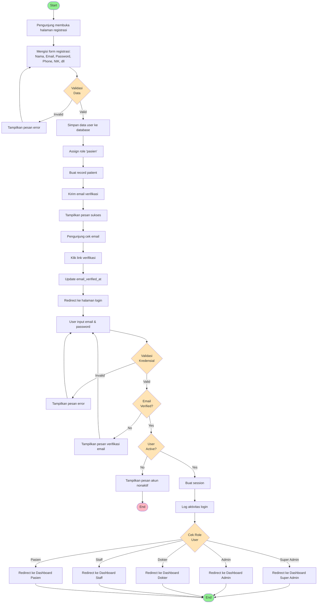
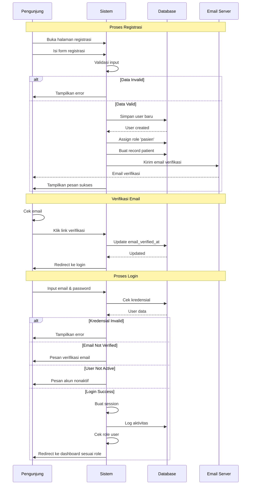

# Activity Diagram - Registrasi dan Login

## Swimlane Diagram

## Deskripsi Proses

### 1. Registrasi
- Pengunjung mengakses halaman registrasi
- Mengisi form dengan data: nama, email, password, phone, NIK, tanggal lahir, gender, alamat
- Sistem melakukan validasi:
  - Email harus unik dan format valid
  - Password minimal 8 karakter
  - NIK harus 16 digit dan unik
  - Semua field required harus diisi
- Jika valid, sistem:
  - Menyimpan data user ke tabel users
  - Assign role 'pasien' menggunakan Spatie Permission
  - Membuat record di tabel patients dengan user_id
  - Mengirim email verifikasi
- Tampilkan pesan sukses dan instruksi cek email

### 2. Verifikasi Email
- User menerima email dengan link verifikasi
- Klik link akan mengupdate kolom email_verified_at
- Redirect ke halaman login

### 3. Login
- User input email dan password
- Sistem validasi kredensial dengan database
- Cek apakah email sudah diverifikasi
- Cek apakah user aktif (is_active = true)
- Jika semua valid:
  - Buat session login
  - Log aktivitas ke audit_logs
  - Redirect ke dashboard sesuai role:
    - Super Admin → /dashboard/super-admin
    - Admin → /dashboard/admin
    - Dokter → /dashboard/dokter
    - Staff → /dashboard/staff
    - Pasien → /dashboard/pasien

### Decision Points
- **Validasi Data**: Cek kelengkapan dan format data registrasi
- **Validasi Kredensial**: Cek kecocokan email dan password
- **Email Verified**: Cek apakah email sudah diverifikasi
- **User Active**: Cek status aktif user
- **Cek Role**: Tentukan dashboard tujuan berdasarkan role

### Error Handling
- Data registrasi invalid → Tampilkan pesan error spesifik per field
- Kredensial salah → "Email atau password salah"
- Email belum diverifikasi → "Silakan verifikasi email terlebih dahulu"
- Akun nonaktif → "Akun Anda telah dinonaktifkan, hubungi admin"
