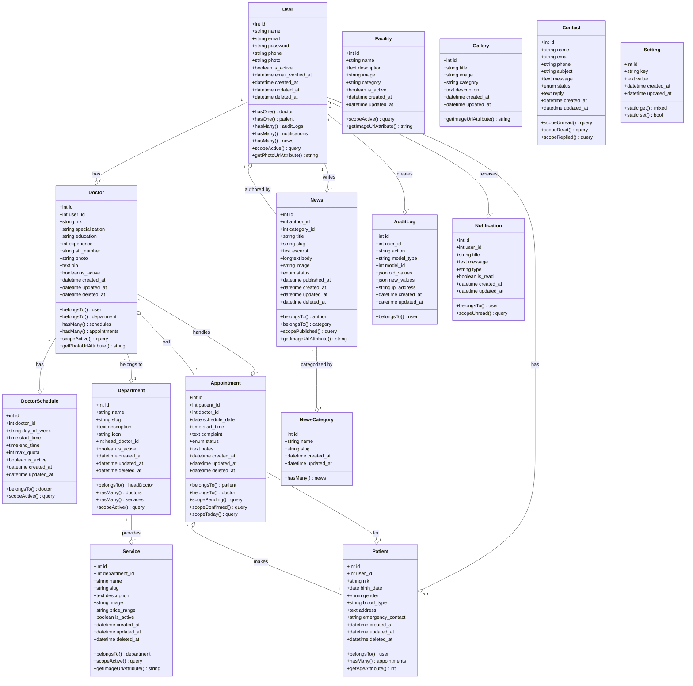

# Class Diagram - Sistem Informasi Rumah Sakit

## Deskripsi Class

### User
Class utama untuk autentikasi dan otorisasi. Menggunakan Spatie Permission untuk role-based access control. Memiliki relasi dengan Doctor, Patient, AuditLog, Notification, dan News.

### Doctor
Menyimpan informasi dokter termasuk spesialisasi, pendidikan, dan pengalaman. Setiap dokter terhubung dengan satu User dan memiliki banyak jadwal praktek serta appointment.

### DoctorSchedule
Mengelola jadwal praktek dokter per hari dengan quota maksimal pasien. Setiap schedule terkait dengan satu dokter.

### Department
Departemen/unit layanan di rumah sakit. Memiliki banyak dokter dan layanan. Dapat memiliki kepala departemen (head_doctor).

### Service
Layanan medis yang disediakan oleh departemen. Menyimpan informasi layanan termasuk deskripsi dan range harga.

### Patient
Data pasien yang terhubung dengan User. Menyimpan informasi medis dasar seperti NIK, tanggal lahir, golongan darah, dan kontak darurat.

### Appointment
Janji temu antara pasien dan dokter. Memiliki status (pending, confirmed, cancelled, done) dan menyimpan keluhan serta catatan.

### News
Berita dan artikel kesehatan. Ditulis oleh user (admin/dokter) dan dikategorikan. Memiliki status draft atau published.

### NewsCategory
Kategori untuk mengelompokkan berita (Kesehatan, Pengumuman, Kegiatan, Tips Kesehatan).

### Facility
Fasilitas yang tersedia di rumah sakit (ICU, Ruang Operasi, Farmasi, dll).

### Gallery
Galeri foto rumah sakit yang dapat dikategorikan.

### Contact
Pesan dari pengunjung melalui form kontak. Memiliki status (unread, read, replied) dan dapat dibalas oleh staff/admin.

### AuditLog
Log aktivitas user untuk audit trail. Menyimpan aksi, model yang diubah, nilai lama dan baru, serta IP address.

### Notification
Notifikasi untuk user. Dapat berupa notifikasi appointment, pengumuman, atau informasi lainnya.

### Setting
Pengaturan sistem dalam format key-value. Digunakan untuk konfigurasi global seperti nama RS, logo, kontak, dll.

## Relasi Antar Class

- **One-to-One**: User ↔ Doctor, User ↔ Patient
- **One-to-Many**: 
  - User → AuditLog, Notification, News
  - Doctor → DoctorSchedule, Appointment
  - Department → Doctor, Service
  - Patient → Appointment
  - NewsCategory → News
- **Many-to-One**:
  - Doctor → Department
  - Appointment → Doctor, Patient
  - News → User (author), NewsCategory
