# Use Case Diagram - Sistem Informasi Rumah Sakit

```mermaid
graph TB
    subgraph "Sistem Informasi Rumah Sakit"
        %% Pengunjung Use Cases
        UC1[Lihat Profil RS]
        UC2[Cari Dokter]
        UC3[Lihat Jadwal Dokter]
        UC4[Lihat Berita]
        UC5[Lihat Layanan]
        UC6[Lihat Fasilitas]
        UC7[Lihat Galeri]
        UC8[Kirim Pesan Kontak]
        UC9[Registrasi Akun]
        
        %% Pasien Use Cases
        UC10[Login]
        UC11[Booking Appointment]
        UC12[Lihat Riwayat Appointment]
        UC13[Update Profil Pasien]
        UC14[Terima Notifikasi]
        UC15[Batalkan Appointment]
        
        %% Dokter Use Cases
        UC16[Update Profil Dokter]
        UC17[Kelola Jadwal Praktek]
        UC18[Lihat Appointment Masuk]
        UC19[Upload Artikel Kesehatan]
        UC20[Lihat Statistik Pasien]
        
        %% Staff Use Cases
        UC21[Konfirmasi Appointment]
        UC22[Input Antrian]
        UC23[Update Status Layanan]
        UC24[Balas Pesan Kontak]
        UC25[Registrasi Pasien Walk-in]
        
        %% Admin Use Cases
        UC26[CRUD Dokter]
        UC27[CRUD Jadwal Dokter]
        UC28[CRUD Layanan]
        UC29[CRUD Departemen]
        UC30[CRUD Berita]
        UC31[CRUD Fasilitas]
        UC32[CRUD Galeri]
        UC33[Kelola Appointment]
        UC34[Lihat Laporan]
        UC35[Export Laporan PDF]
        
        %% Super Admin Use Cases
        UC36[Manajemen User]
        UC37[Assign Role]
        UC38[Lihat Audit Log]
        UC39[Pengaturan Sistem]
        UC40[Konfigurasi Global]
    end
    
    %% Actors
    Pengunjung((Pengunjung))
    Pasien((Pasien))
    Dokter((Dokter))
    Staff((Staff))
    Admin((Admin))
    SuperAdmin((Super Admin))
    
    %% Pengunjung Relations
    Pengunjung --> UC1
    Pengunjung --> UC2
    Pengunjung --> UC3
    Pengunjung --> UC4
    Pengunjung --> UC5
    Pengunjung --> UC6
    Pengunjung --> UC7
    Pengunjung --> UC8
    Pengunjung --> UC9
    
    %% Pasien Relations
    Pasien --> UC10
    Pasien --> UC11
    Pasien --> UC12
    Pasien --> UC13
    Pasien --> UC14
    Pasien --> UC15
    Pasien --> UC2
    Pasien --> UC3
    
    %% Dokter Relations
    Dokter --> UC10
    Dokter --> UC16
    Dokter --> UC17
    Dokter --> UC18
    Dokter --> UC19
    Dokter --> UC20
    Dokter --> UC14
    
    %% Staff Relations
    Staff --> UC10
    Staff --> UC21
    Staff --> UC22
    Staff --> UC23
    Staff --> UC24
    Staff --> UC25
    
    %% Admin Relations
    Admin --> UC10
    Admin --> UC21
    Admin --> UC22
    Admin --> UC24
    Admin --> UC26
    Admin --> UC27
    Admin --> UC28
    Admin --> UC29
    Admin --> UC30
    Admin --> UC31
    Admin --> UC32
    Admin --> UC33
    Admin --> UC34
    Admin --> UC35
    
    %% Super Admin Relations
    SuperAdmin --> UC10
    SuperAdmin --> UC36
    SuperAdmin --> UC37
    SuperAdmin --> UC38
    SuperAdmin --> UC39
    SuperAdmin --> UC40
    
    %% Include & Extend Relations
    UC11 -.->|include| UC10
    UC12 -.->|include| UC10
    UC15 -.->|extend| UC12
    UC35 -.->|extend| UC34
    UC21 -.->|include| UC18
```

## Deskripsi Use Case

### Pengunjung (Guest)
1. **Lihat Profil RS** - Melihat informasi profil rumah sakit (sejarah, visi misi, akreditasi)
2. **Cari Dokter** - Mencari dokter berdasarkan spesialisasi atau nama
3. **Lihat Jadwal Dokter** - Melihat jadwal praktek dokter
4. **Lihat Berita** - Membaca berita dan artikel kesehatan
5. **Lihat Layanan** - Melihat daftar layanan yang tersedia
6. **Lihat Fasilitas** - Melihat fasilitas rumah sakit
7. **Lihat Galeri** - Melihat galeri foto rumah sakit
8. **Kirim Pesan Kontak** - Mengirim pesan melalui form kontak
9. **Registrasi Akun** - Mendaftar akun baru sebagai pasien

### Pasien
10. **Login** - Masuk ke sistem dengan kredensial
11. **Booking Appointment** - Membuat janji temu dengan dokter
12. **Lihat Riwayat Appointment** - Melihat riwayat janji temu
13. **Update Profil Pasien** - Mengupdate data profil pribadi
14. **Terima Notifikasi** - Menerima notifikasi status appointment
15. **Batalkan Appointment** - Membatalkan janji temu yang sudah dibuat

### Dokter
16. **Update Profil Dokter** - Mengupdate profil dan spesialisasi
17. **Kelola Jadwal Praktek** - Mengelola jadwal praktek sendiri
18. **Lihat Appointment Masuk** - Melihat daftar appointment yang masuk
19. **Upload Artikel Kesehatan** - Mengunggah artikel kesehatan
20. **Lihat Statistik Pasien** - Melihat statistik pasien yang ditangani

### Staff / Operator
21. **Konfirmasi Appointment** - Mengkonfirmasi atau menolak appointment
22. **Input Antrian** - Menginput antrian pasien harian
23. **Update Status Layanan** - Mengupdate status layanan harian
24. **Balas Pesan Kontak** - Membalas pesan dari form kontak
25. **Registrasi Pasien Walk-in** - Mendaftarkan pasien yang datang langsung

### Admin Rumah Sakit
26. **CRUD Dokter** - Mengelola data dokter (Create, Read, Update, Delete)
27. **CRUD Jadwal Dokter** - Mengelola jadwal praktek dokter
28. **CRUD Layanan** - Mengelola data layanan
29. **CRUD Departemen** - Mengelola data departemen
30. **CRUD Berita** - Mengelola berita dan pengumuman
31. **CRUD Fasilitas** - Mengelola data fasilitas
32. **CRUD Galeri** - Mengelola galeri foto
33. **Kelola Appointment** - Mengelola semua appointment
34. **Lihat Laporan** - Melihat laporan dan statistik
35. **Export Laporan PDF** - Mengekspor laporan ke format PDF

### Super Admin
36. **Manajemen User** - Mengelola semua user sistem
37. **Assign Role** - Memberikan role kepada user
38. **Lihat Audit Log** - Melihat log aktivitas semua user
39. **Pengaturan Sistem** - Mengatur konfigurasi sistem
40. **Konfigurasi Global** - Mengatur pengaturan global aplikasi

## Relasi Antar Use Case

- **Include**: Use case yang harus dilakukan terlebih dahulu
  - Booking Appointment include Login
  - Lihat Riwayat Appointment include Login
  - Konfirmasi Appointment include Lihat Appointment Masuk

- **Extend**: Use case tambahan yang bersifat opsional
  - Batalkan Appointment extend Lihat Riwayat Appointment
  - Export Laporan PDF extend Lihat Laporan
